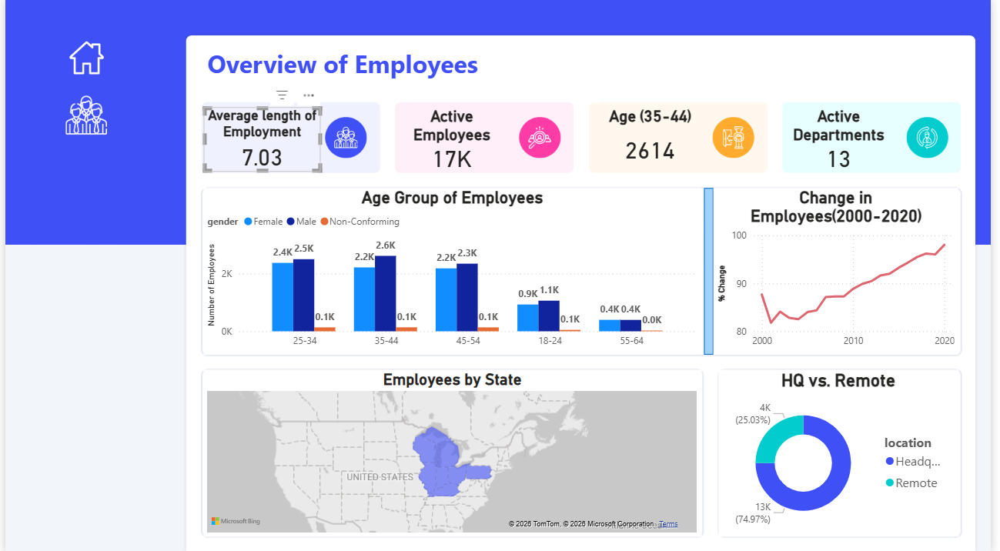
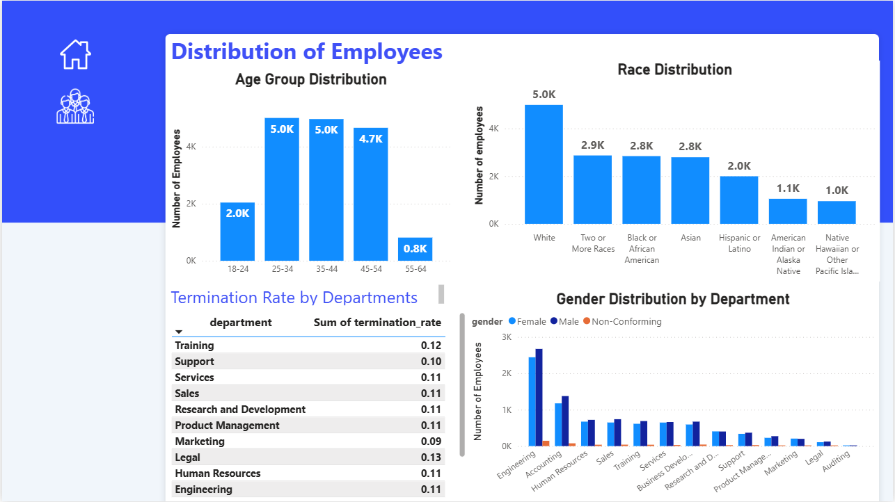

Dưới đây là bản dịch tiếng Việt:

---

# Phân bố Nhân viên (Employee-Distribution)

Chào mừng đến với dự án **Employee-Distribution**! Repository này chứa các insight và trực quan hóa dữ liệu được khai thác từ một bộ dữ liệu HR lớn kéo dài từ năm 2000 đến 2020, với hơn 22.000 dòng dữ liệu.

Dữ liệu đã được làm sạch và phân tích kỹ lưỡng bằng **PostgreSQL**, và kết quả được trực quan hóa bằng **Power BI**. Dashboard này nhằm trả lời các câu hỏi quan trọng liên quan đến nhân sự và cung cấp góc nhìn rõ ràng về lực lượng lao động của tổ chức.

---

## Báo cáo Power BI

  
  

## Các câu hỏi chính được phân tích

1. **Phân bố giới tính**: Tỷ lệ nam/nữ trong công ty.
2. **Phân bố chủng tộc/dân tộc**: Thành phần chủng tộc và dân tộc của nhân viên.
3. **Phân bố độ tuổi**: Insight về độ tuổi của nhân viên.
4. **Trụ sở chính vs làm việc từ xa**: So sánh số lượng nhân viên làm tại văn phòng và làm remote.
5. **Thời gian làm việc trung bình của nhân viên đã nghỉ**: Tính tenure trung bình trước khi nghỉ việc.
6. **Phân bố giới tính theo phòng ban và vị trí**: Sự khác biệt giới tính giữa các bộ phận và chức danh.
7. **Phân bố chức danh công việc**: Các vị trí trong công ty phân bổ như thế nào.
8. **Tỷ lệ nghỉ việc cao nhất theo phòng ban**: Bộ phận nào có turnover cao nhất.
9. **Phân bố nhân viên theo địa lý (bang)**: Nhân viên tập trung ở khu vực nào.
10. **Biến động số lượng nhân viên theo thời gian**: Theo dõi xu hướng tăng/giảm nhân sự qua các năm.
11. **Phân bố thâm niên theo phòng ban**: Tenure của nhân viên theo từng bộ phận.

---

## Tóm tắt kết quả

* **Đa dạng giới tính**: Nhân viên nam nhiều hơn nữ.
* **Chủng tộc/dân tộc**: Người da trắng chiếm đa số; Native Hawaiian và American Indian chiếm ít nhất.
* **Độ tuổi**: Nhân viên từ 20–57 tuổi, chủ yếu nằm trong nhóm 25–34.
* **Nơi làm việc**: Phần lớn làm việc tại trụ sở, ít hơn là remote.
* **Thời gian làm việc trước khi nghỉ**: Trung bình khoảng 7 năm.
* **Giới tính theo phòng ban**: Tương đối cân bằng, nhưng nam vẫn nhỉnh hơn ở đa số phòng ban.
* **Phòng ban có turnover cao**: Marketing cao nhất, sau đó là Training. Các phòng R&D, Support và Legal thấp nhất.
* **Phân bố địa lý**: Nhiều nhân viên đến từ bang Ohio.
* **Xu hướng nhân sự**: Số lượng nhân viên tăng dần qua các năm.
* **Thâm niên theo phòng ban**: Trung bình khoảng 8 năm; Legal và Auditing cao nhất, Services, Sales và Marketing thấp nhất.

---

## Hạn chế

* Một số bản ghi có tuổi âm bị loại bỏ (967 bản ghi). Chỉ sử dụng dữ liệu từ 18 tuổi trở lên.
* Một số ngày nghỉ việc nằm quá xa trong tương lai nên bị loại (1599 bản ghi). Chỉ tính đến ngày hiện tại.
